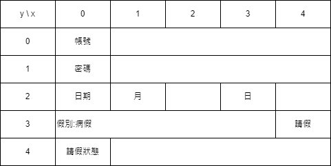
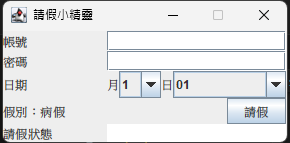
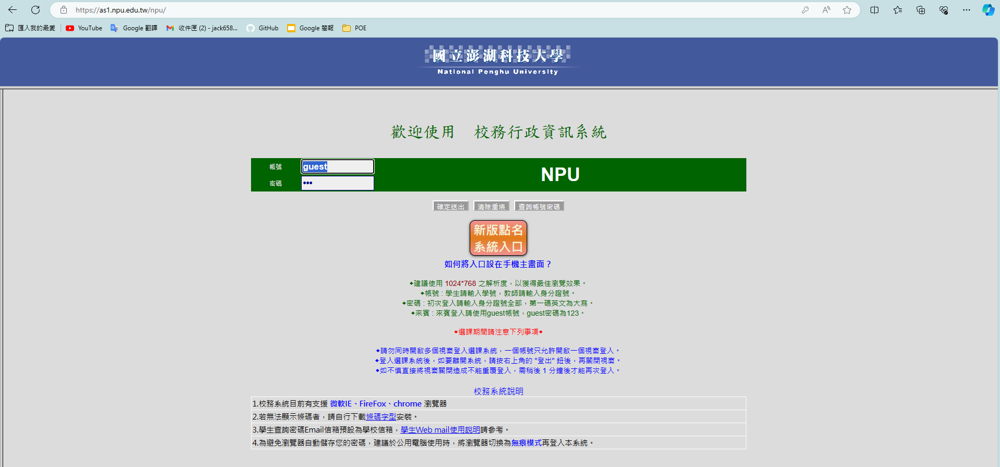
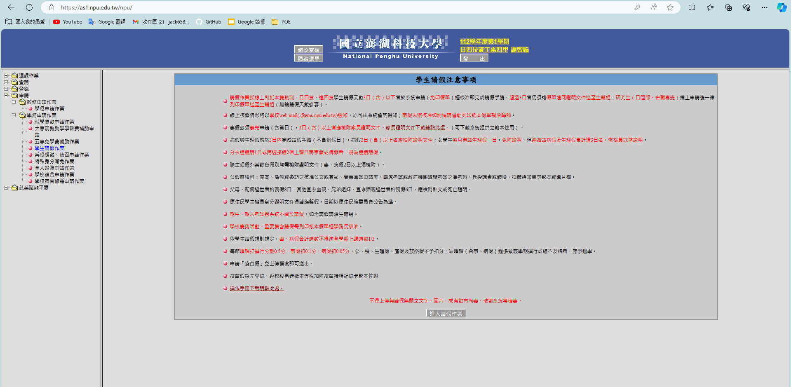
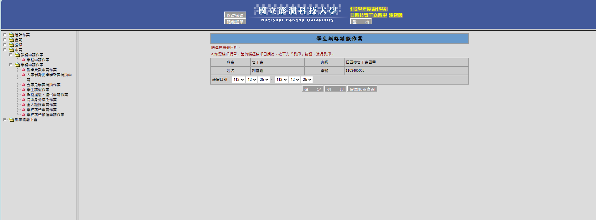
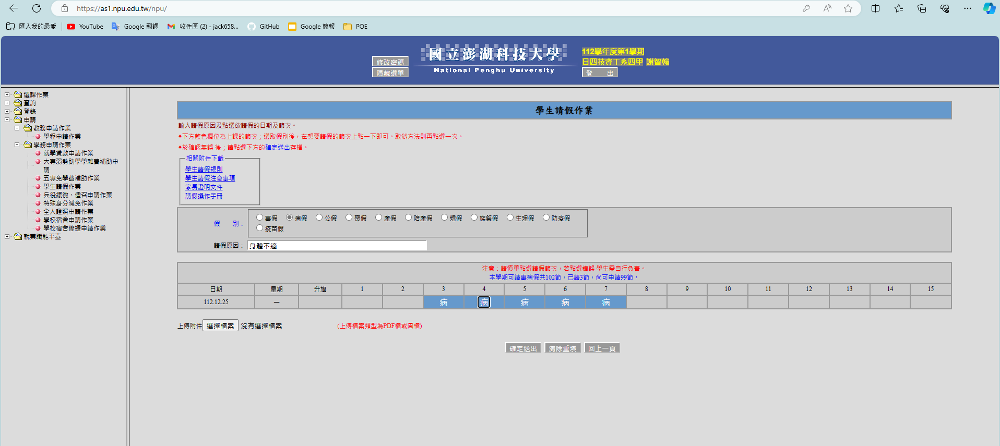

# 澎科請假小精靈

這算是一個合作的Side Project，感謝合作者 [hank12345](https://github.com/hankchi12345)  
另外，此篇僅作報告使用，**請勿真的拿去請假**，這會違反資安，要是被學校發現，你自求多福我提醒過了  

## 目錄  

- [澎科請假小精靈](#澎科請假小精靈)
  - [目錄](#目錄)
  - [簡介](#簡介)
  - [程式碼](#程式碼)
  - [contect](#contect)
  - [setDate](#setdate)
  - [dateToROC](#datetoroc)
  - [待改善(🏗️施工中)](#待改善️施工中)

## 簡介  

極簡Layout圖  
  

實際截圖  
  
極簡流程圖  
  

整體運作原理是透過更改時間戳，讓伺服端收到錯誤時間進而覺得你穿越時空，達成過期了還能請假的目的  
如果你看到這裡還不死心，以下是這支程式的缺點  

1. 伺服端不能做double check，不然他一發現時間對不上你不能請
2. 學務處看假單那個不能檢查，一檢查時間不對你也不能請  
3. 你的班導也不能檢查，時間對不上你還是不能請  
4. 最後，這麼做，違反資安，雖然抓去關可能可以請公假  

## 程式碼

基礎設定，諸如視窗大小等等，以下略過  

```java
//handel user_input
        obj_list.jtf_account.getDocument().addDocumentListener(new DocumentListener() {

            @Override
            public void insertUpdate(DocumentEvent e) {
                obj_list.setUser_account(obj_list.jtf_account.getText());
            }

            @Override
            public void removeUpdate(DocumentEvent e) {
                obj_list.setUser_account(obj_list.jtf_account.getText());
            }

            @Override
            public void changedUpdate(DocumentEvent e) {
                
            }
            
        });
        obj_list.jpf_password.getDocument().addDocumentListener(new DocumentListener() {

            @Override
            public void insertUpdate(DocumentEvent e) {
                obj_list.setUesr_password(String.valueOf(obj_list.jpf_password.getPassword()));
            }

            @Override
            public void removeUpdate(DocumentEvent e) {
                obj_list.setUesr_password(String.valueOf(obj_list.jpf_password.getPassword()));
            }

            @Override
            public void changedUpdate(DocumentEvent e) {
                
            }
            
        });
```

監聽USER輸入，使用setter & getter，所以本機只有變數，不儲存帳密，程式關掉就沒了  
想要"記住我的登入"這種方便功能的，請乖乖去上課  

```java
//handel button
        obj_list.jbt_ask.addActionListener(new ActionListener() {

            @Override
            public void actionPerformed(ActionEvent e) {
                contect.main(null);
            }
            
        });
```  

按下請假按鈕時將會執行contect.java，做爬蟲和請假的動作  

## contect  

```java
        //input account
        WebElement account = wd.findElement(By.id("uid"));
        account.clear();
        account.sendKeys(obj_list.getUser_account());

        //input password
        WebElement password = wd.findElement(By.id("pwd"));
        password.clear();
        password.sendKeys(obj_list.getUesr_password());

        //login
        WebElement loginbutton = wd.findElement(By.id("chk"));
        loginbutton.click();
```  

把欄位清空，輸入getter回傳的帳號&密碼，按下登入按鈕  


```java
        WebElement apply = wd.findElement(By.xpath("/html/body/span/table/tbody/tr[4]/td[2]/table[1]/tbody/tr/td[2]/span"));
        apply.click();
        WebElement ask = wd.findElement(By.xpath("/html/body/span/table/tbody/tr[4]/td[2]/table[2]/tbody/tr[2]/td[2]/table[2]/tbody/tr[4]/td[2]/table/tbody/tr/td[2]/div"));
        ask.click();

        wd.switchTo().defaultContent();
        wd.switchTo().frame("Main");
        WebElement button = wd.findElement(By.id("confirm"));
        button.click();
```  

選擇並按下請假作業，然後同意(寫這隻程式很明顯沒在看須遵守事項)  
  

```java
        WebElement smonth = wd.findElement(By.id("etxt_smonth"));
        Select selectSmonth = new Select(smonth);
        selectSmonth.selectByValue(obj_list.jco_month.getSelectedItem().toString());

        WebElement sday = wd.findElement(By.id("etxt_sday"));
        Select selectSday = new Select(sday);
        selectSday.selectByValue(obj_list.jco_day.getSelectedItem().toString());

        WebElement emonth = wd.findElement(By.id("etxt_emonth"));
        Select selectEmonth = new Select(emonth);
        selectEmonth.selectByValue(obj_list.jco_month.getSelectedItem().toString());

        WebElement eday = wd.findElement(By.id("etxt_eday"));
        Select selectEday = new Select(eday);
        selectEday.selectByValue(obj_list.jco_day.getSelectedItem().toString());

        button = wd.findElement(By.id("send"));
        button.click();
```

把日期改成你輸入的，想請假但已過期的那天，然後按下確定按鈕  
  

```java
        String newdate = setDate(js.executeScript("return document.getElementById('rtxt_today').value"));
        js.executeScript("document.getElementById('rtxt_today').value = '" + newdate + "';");
        String dataROC = dateToROC(js.executeScript("return document.getElementById('rtxt_todayroc').value"));
        js.executeScript("document.getElementById('rtxt_todayroc').value = '" + dataROC + "';");
```  

這裡調用Selenium提供的接口，可以輸入JS腳本並執行，[setDate](#setdate)跟[dateToROC](#datetoroc)兩個副程式後面講，這裡腳本作用是把時間戳改成你想請假的那天，藉此達成過期還能請假的目的  
(JavaScript可以算是一種Java吧，JS我只寫了這段拜託老師手下留情)  

```java
        WebElement radiobutton = wd.findElement(By.id("rtxt_leave_kind22"));
        radiobutton.click();
        WebElement askforwhy = wd.findElement(By.id("rtxt_lea_reason"));
        askforwhy.clear();
        askforwhy.sendKeys("身體不適");
```  

選取"病假"按鈕並填入請假事由:身體不適  
(病假代號是22，BTW事假是21，想請別種假自己看，我這裡統一病假)  

```java
        List<WebElement> checkbox = wd.findElements(By.xpath("//td[@bgcolor='#6699cc']/*"));
        for(int i=0 ; i<checkbox.size() ; i+=2){
            WebElement element = checkbox.get(i);
            element.click();
        }
        
        WebElement submit = wd.findElement(By.id("rtxt_sent"));
        //submit.click();
```  

選取所有當天可以請的假，壞學生要翹就要翹整天  
  
另外，最後的submit按鈕，就是確認送出，我預設是註解掉，因為我沒有要請假  

## setDate  

```java
    public String setDate(Object date){
        String newdate = date.toString();
        String[] util = newdate.split("/");

        util[1] = obj_list.jco_month.getSelectedItem().toString();
        util[2] = obj_list.jco_day.getSelectedItem().toString();
        newdate = util[0] + "/" + util[1] + "/" + util[2];
        return newdate;
    }
```  

讀取原本時間戳，更改成你輸入的想請假的那天  

## dateToROC  

```java
    public String dateToROC(Object date){
        String dateROC = date.toString();
        String year = dateROC.substring(0, 3);
        String MandD = dateROC.substring(3);

        MandD = (obj_list.jco_month.getSelectedItem().toString()) + (obj_list.jco_day.getSelectedItem().toString());
        dateROC = year + MandD;
        return dateROC;
    }
```

這裡做一樣的事，更改時間戳，你會發現我取名叫ToROC但根本沒做轉換，原因是我後來整理的時候發現我可以爬他原本的民國格式就好不用自己加1911，但方便辨識我還是保留了函式名稱  

## 待改善(🏗️施工中)  

1. "記住登入"功能
2. 更為彈性的選擇，而非固定請整天
3. 更為彈性的選擇，而非固定病假
4. 好看且方便的UI
5. 寫好防呆和回傳
